Principles of Modelling and Simulation in Epidemiology
===========
Laboratory exercise 2
-----------

### Suggested solutions by
Andreas Karlsson, November 2013

More information regarding Gillespie Stochastic Simulation Algorithm at **http://www.jstatsoft.org/v25/i12/paper**


```r
require(deSolve)  #For the deterministic solutions (also for initial value and environmental stochasticity)
require(GillespieSSA)  #Gillespie Stochastic Simulation Algorithm with 'Explicit tau-leap'
require(ggplot2)  #Extravagant plotting tool (not necessary to answer the questions)
require(plyr)  #Handy data manipulation tool (not necessary to answer the questions)
```

### 2.1 RNGs
#### Uniform Distribution

```r
layout(matrix(c(1, 2), 1, 2, byrow = TRUE))
unif <- runif(n = 10000, min = 5, max = 15)
plot(unif, ylim = c(0, 20), pch = ".") + abline(h = mean(unif), col = 2, lwd = 3)
hist(unif)
```

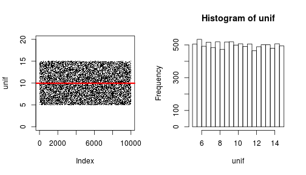 

#### Exponential Distribution

```r
layout(matrix(c(1, 2), 1, 2, byrow = TRUE))
expo <- rexp(n = 10000, rate = 4)
plot(expo, pch = ".") + abline(h = mean(expo), col = 2, lwd = 3)
hist(expo)
```

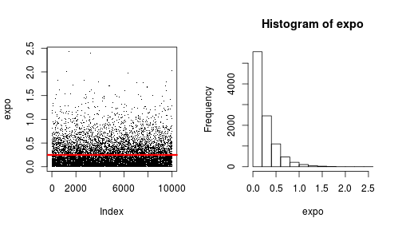 

---
#### Normal Distribution

```r
layout(matrix(c(1, 2), 1, 2, byrow = TRUE))
norm <- rnorm(n = 10000, mean = 2.5, sd = 10)
plot(norm, pch = ".") + abline(h = mean(norm), col = 2, lwd = 3)
hist(norm)
```

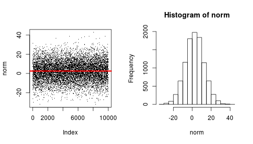 

#### Poisson Distribution

```r
layout(matrix(c(1, 2), 1, 2, byrow = TRUE))
po <- rpois(n = 10000, lambda = 3.5)
plot(po) + abline(h = mean(po), col = 2, lwd = 3)
hist(po)
```

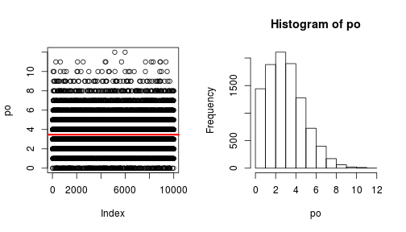 

---
### 2.2 Construction of other RNGs
#### Binomial Distribution direct method

```r
layout(matrix(c(1, 2), 1, 2, byrow = TRUE))
bin <- rbinom(n = 100, size = 20, prob = 0.3)
plot(bin) + abline(h = mean(bin), col = 2, lwd = 3)
hist(bin, breaks = 0:20)
```

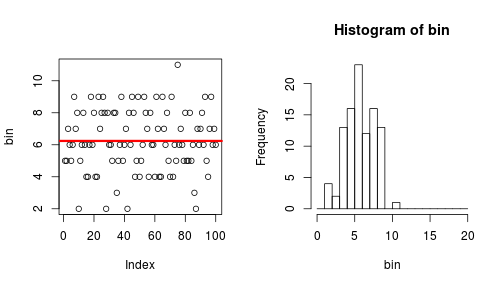 

#### Binomial Distribution from Uniform Distribution

```r
layout(matrix(c(1, 2), 1, 2, byrow = TRUE))
all_ber <- NULL
for (i in 1:20) {
    unif <- runif(n = 100, min = 0, max = 1)
    ber <- ifelse(unif < 0.3, 1, 0)
    all_ber <- rbind(all_ber, ber)
}
bin <- colSums(all_ber)
plot(bin) + abline(h = mean(bin), col = 2, lwd = 5)
hist(bin, breaks = 0:20)
```

 

---
### 2.3 RNG and time-step

```r
rm(list = ls(all = TRUE))
layout(matrix(c(1:6), 2, 3, byrow = TRUE))
for (dt in c(1, 0.1)) {
    derivs <- function(times, state, parameters) {
        with(as.list(c(state, parameters)), {
            dU <- unif[times/dt] - c1 * U
            dUout <- c1 * U
            return(list(c(dU, dUout)))
        })
    }
    init <- c(U = 0, Uout = 0)
    times <- seq(1, 100, by = dt)
    unif <- runif(n = length(times), min = 0, max = 10)
    parameters <- c(unif, c1 = 0.1, dt)
    out <- as.data.frame(ode(y = init, times = times, func = derivs, parms = parameters))
    
    ## Plot results
    plot(times, unif, type = "l", xlab = "Time", ylab = "AU / t", main = paste("In_Unif, ", 
        sprintf("dt=%.1f", dt)), lty = 1, bty = "l", col = 2)
    plot(times, out$U, type = "l", xlab = "Time", ylab = "AU", main = paste("U, ", 
        sprintf("dt=%.1f", dt)), lty = 1, bty = "l", col = 2)
    plot(times, out$Uout/times, type = "l", xlab = "Time", ylab = "AU / t", 
        main = paste("Out_U, ", sprintf("dt=%.1f", dt)), lty = 1, bty = "l", 
        col = 2)
}
```

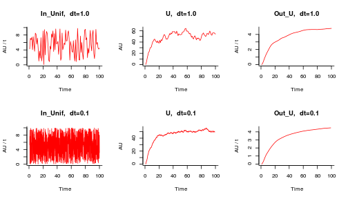 

### 2.4 Seeds - making a stochastic simulation reproducible

```r
rm(list = ls(all = TRUE))
layout(matrix(c(1:2), 1, 2, byrow = TRUE))
set.seed(1234)
un1 <- runif(n = 100, min = 0, max = 10)
set.seed(1234)
un2 <- runif(n = 100, min = 0, max = 10)
plot(1:100, un1, type = "l", xlab = "Time", ylab = "AU", main = "Uniform 1", 
    lty = 1, bty = "l", col = 2)
plot(1:100, un2, type = "l", xlab = "Time", ylab = "AU", main = "Uniform 2", 
    lty = 1, bty = "l", col = 2)
```

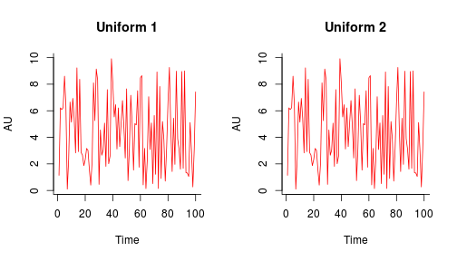 

---
### 3.1 Demographic Stochasticity

```r
rm(list = ls(all = TRUE))
layout(matrix(1:2, 1, 2))
init <- c(X = 1)
parms <- c(c1 = 1, c2 = 0.01)
deriv <- function(times, state, parameters) {
    with(as.list(c(state, parameters)), {
        dX <- c1 * X - c2 * X * X
        return(list(c(dX)))
    })
}
times <- seq(0, 20, by = 0.01)
out <- as.data.frame(ode(y = init, times = times, func = deriv, parms = parms))
out$time <- NULL
matplot(times, out, type = "l", xlab = "Time", ylab = "AU", ylim = c(0, 120), 
    main = "Deterministic Logistic Model", lty = 1, lwd = 1, col = 2)

# Gillespie with 'Explicit tau-leap' => user-defined step size
a <- c("c1 * X", "c2 * X * X")
nu <- matrix(c(+1, -1), ncol = 2)
out <- ssa(init, a, nu, parms, tf = 20, tau = 0.01, method = "ETL", maxWallTime = 5, 
    simName = "Stochastic Logistic Model")
ssa.plot(out, show.legend = F)
```

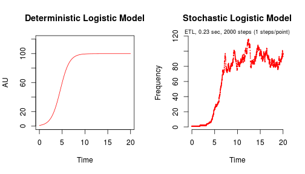 

---
### 3.2 Environmental Stochasticity

```r
rm(list = ls(all = TRUE))
layout(matrix(1:2, 1, 2))
for (f in c(5, 0.1)) {
    deriv <- function(Time, state, parameters) {
        with(as.list(c(state, parameters)), {
            set.seed(1000 + ceiling(Time/f))  #Shifting seed at an interval
            c1 <- runif(1, 0.5 * c1, 1.5 * c1)
            set.seed(2000 + ceiling(Time/f))
            c2 <- rnorm(1, c2, 0.2 * c2)
            dX <- c1 * X - c2 * X * X
            return(list(c(dX)))
        })
    }
    
    init <- c(X = 1)
    times <- seq(0, 20, by = 0.01)
    parameters <- c(c1 = 1, c2 = 0.01, f)
    out <- as.data.frame(ode(y = init, times = times, func = deriv, parms = parameters))
    out$time <- NULL
    matplot(times, out, type = "l", xlab = "Time", ylab = "AU", ylim = c(0, 
        120), main = paste("Environmental Stochasticity\n", sprintf("Interval=%.1f", 
        f)), lty = 1, lwd = 1, col = 2)
}
```

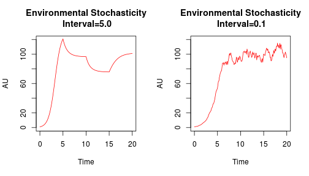 

### 3.3 Initial Value Stochasticity

```r
rm(list = ls(all = TRUE))
layout(matrix(1:2, 1, 2))
for (seed_n in c(1, 1000)) {
    set.seed(seed_n)
    deriv <- function(Time, state, parameters) {
        with(as.list(c(state, parameters)), {
            dX <- c1 * X - c2 * X * X
            return(list(c(dX)))
        })
    }
    init <- c(X = rbinom(1, 5, 0.2))
    times <- seq(0, 20, by = 0.01)
    parameters <- c(c1 = 1, c2 = 0.01)
    out <- as.data.frame(ode(y = init, times = times, func = deriv, parms = parameters))
    out$time <- NULL
    matplot(times, out, type = "l", xlab = "Time", ylab = "AU", ylim = c(0, 
        120), main = "Initial Value Stochasticity", lty = 1, lwd = 1, col = 2)
}
```

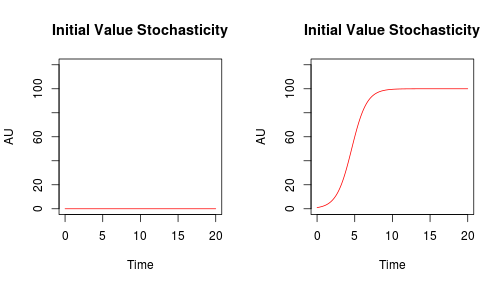 

---
### 4.1 Output within replication

```r
rm(list = ls(all = TRUE))
layout(matrix(1:2, 1, 2))
parms <- c(c1 = 1, c2 = 0.01)
x0 <- c(X = 100)
a <- c("c1 * X", "c2 * X * X")
nu <- matrix(c(+1, -1), ncol = 2)
sim_out <- data.frame(dt = character(), X = numeric())
for (dt in c(0.1, 0.01)) {
    #'Explicit tau-leap' => user-defined step size
    out <- ssa(x0, a, nu, parms, tf = 100, tau = dt, method = "ETL", maxWallTime = 5, 
        simName = "Stochastic Logistic Model", verbose = F)
    ## Plot results
    ssa.plot(out, show.legend = F) + abline(h = mean(out$data[, 2]), col = 1) + 
        abline(h = mean(out$data[, 2]) + sd(out$data[, 2]), col = 1, lty = 3) + 
        abline(h = mean(out$data[, 2]) - sd(out$data[, 2]), col = 1, lty = 3)
    
    sim_out <- rbind(sim_out, data.frame(dt = rep(dt, nrow(out$data)), X = out$data[, 
        2]))
}
```

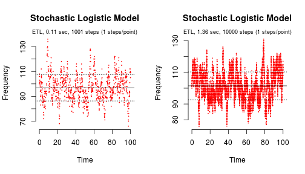 


```r
dt_summay <- ddply(sim_out, .(dt), summarise, Lowest_X = min(X), Highest_X = max(X), 
    StdDev_X = round(sd(X), 0))
print(dt_summay)
```

```
##     dt Lowest_X Highest_X StdDev_X
## 1 0.01       76       131        9
## 2 0.10       66       136       11
```

---
### 4.2 Output over many replications

```r
rm(list = ls(all = TRUE))
sim_out <- data.frame(Repetition = numeric(), Sample = numeric(), Time = double(), 
    X = double())
parms <- c(c1 = 1, c2 = 0.01)
x0 <- c(X = 100)
a <- c("c1 * X", "c2 * X * X")
nu <- matrix(c(+1, -1), ncol = 2)
for (i in c(1:1000)) {
    #'Explicit tau-leap' => user-defined step size
    out <- ssa(x0, a, nu, parms, tf = 100, tau = 0.1, method = "ETL", maxWallTime = 5)
    colnames(out$data)[1] <- "Time"
    Repetition <- rep(i, nrow(out$data))
    Sample <- 1:nrow(out$data)
    sim_out <- rbind(sim_out, cbind(Repetition, Sample, out$data))
}
within_summary <- ddply(sim_out, .(Repetition), summarise, X_end = tail(X, n = 1), 
    X_max = max(X))

## Plot results
ggplot(data = sim_out, aes(x = Time, y = X, colour = Repetition)) + geom_line(aes(group = Repetition))
```

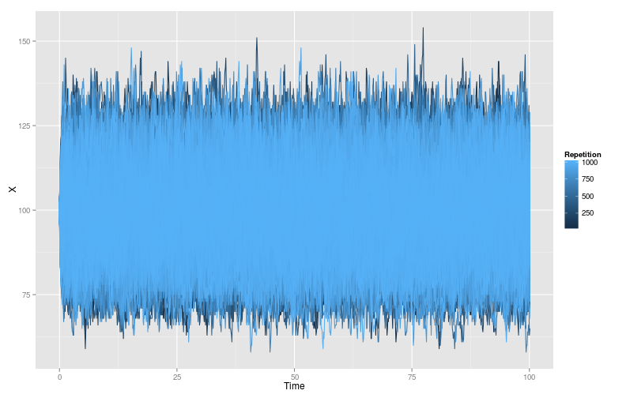 

---

```r
median_quantiles <- quantile(within_summary$X_end, c(0.025, 0.5, 0.975))
within_summary$Percentile <- "middle"
within_summary$Percentile[within_summary$X_end < median_quantiles["2.5%"]] <- "<2.5%"
within_summary$Percentile[within_summary$X_end > median_quantiles["97.5%"]] <- ">97.5%"

mean_sd <- data.frame(mean = mean(within_summary$X_end), sd = sd(within_summary$X_end))
ggplot(data = within_summary, aes(x = Repetition, y = X_end, colour = Percentile)) + 
    geom_point(aes(group = Percentile)) + ggtitle("X(100), Mean & 95% CI") + 
    geom_hline(data = mean_sd, aes(yintercept = mean, 3), linetype = 1, colour = "#990000") + 
    geom_hline(data = mean_sd, aes(yintercept = mean + 1.9604 * sd, 3), linetype = 2, 
        colour = "#990000") + geom_hline(data = mean_sd, aes(yintercept = mean - 
    1.9604 * sd, 3), linetype = 2, colour = "#990000") + ylab("X(100)")
```

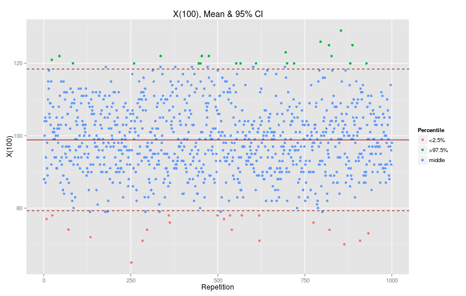 

#### Mean and CI for X[100]:

```r
print(paste("Mean:", round(mean_sd$mean), "  95% CI[", round(mean_sd$mean - 
    mean_sd$sd * 1.9604), ",", round(mean_sd$mean + mean_sd$sd * 1.9604), "]"))
```

```
## [1] "Mean: 99   95% CI[ 79 , 118 ]"
```

#### Corresponding percentiles:

```r
print(median_quantiles)
```

```
##  2.5%   50% 97.5% 
##    79    99   119
```

#### The maximum of the end values:

```r
print(paste("Max[X(100)]:", max(within_summary$X_end)))
```

```
## [1] "Max[X(100)]: 129"
```

#### The maximum of the highest value within each repetition:

```r
print(paste("Max[Highest_X]:", max(within_summary$X_max)))
```

```
## [1] "Max[Highest_X]: 154"
```

---

### 5 Comparing Logistic & SI models

```r
rm(list = ls(all = TRUE))
sim_out <- data.frame(Repetition = numeric(), Sample = numeric(), Time = numeric(), 
    X = numeric(), Model = character())

## Defining constants
parms <- c(c1 = 1, c2 = 0.1, r = 0.1)
init <- c(X = 1, S = 99, I = 1)

## Deterministic Logistic & SI model
deriv <- function(time, state, parameters) {
    with(as.list(c(state, parameters)), {
        dX <- c1 * X - c2 * X * X
        dS <- -r * I * S
        dI <- r * I * S
        return(list(c(dX, dS, dI)))
    })
}
times <- seq(0, 20, by = 0.01)
out <- as.data.frame(ode(y = init, times = times, func = deriv, parms = parms))
Repetition <- rep(1, nrow(out))
Sample <- 1:nrow(out)
sim_out <- rbind(sim_out, data.frame(Repetition, Sample, Time = times, X = out$X, 
    Model = rep("Deterministic Logistic Model", nrow(out))))
sim_out <- rbind(sim_out, data.frame(Repetition, Sample, Time = times, X = out$I, 
    Model = rep("Deterministic SI Model", nrow(out))))

## Stochastic Logistic & SI model
for (i in 1:1000) {
    a <- c("c1 * X", "c2 * X * X", "r*S*I")
    nu <- matrix(c(+1, -1, 0, 0, 0, -1, 0, 0, +1), nrow = 3, byrow = T)
    #'Explicit tau-leap' => user-defined step size
    out <- ssa(init, a, nu, parms, tf = 20, tau = 0.01, method = "ETL", maxWallTime = 5, 
        ignoreNegativeState = T)  #Gives warning instead of error for negative number of susceptibles.
    Repetition <- rep(i, nrow(out$data))
    Sample <- 1:nrow(out$data)
    sim_out <- rbind(sim_out, data.frame(Repetition, Sample, Time = out$data[, 
        1], X = out$data[, 2], Model = rep("Stochastic Logistic Model", nrow(out$data))))
    sim_out <- rbind(sim_out, data.frame(Repetition, Sample, Time = out$data[, 
        1], X = out$data[, 4], Model = rep("Stochastic SI Model", nrow(out$data))))
}
within_summary <- ddply(sim_out, .(Model, Repetition), summarise, X_end = tail(X, 
    n = 1))

## Plot results
ggplot(sim_out, aes(x = Time, y = X, colour = Repetition)) + geom_line(aes(group = Repetition)) + 
    facet_wrap(~Model, ncol = 2)
```

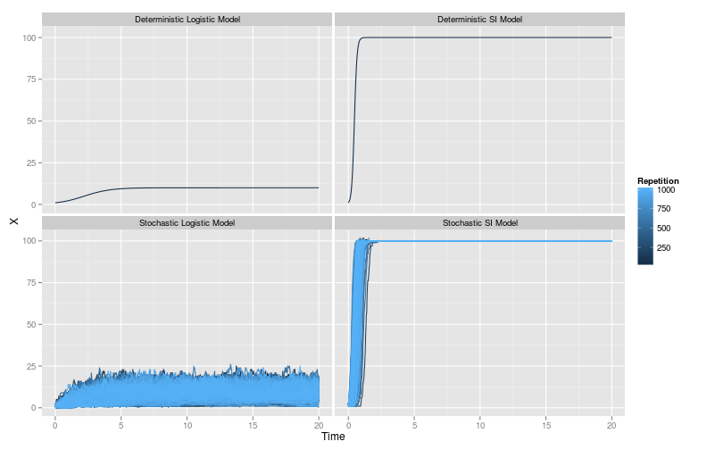 

---

```r
mean_sd <- ddply(within_summary, .(Model), summarise, mean = mean(X_end, na.rm = TRUE), 
    sd = sd(X_end, na.rm = TRUE))
ggplot(data = within_summary, aes(x = Repetition, y = X_end)) + geom_point() + 
    ylab("X(end)") + geom_hline(data = mean_sd, aes(yintercept = mean, 3), linetype = 1, 
    colour = "#990000") + geom_hline(data = mean_sd, aes(yintercept = mean + 
    1.9604 * sd, 3), linetype = 2, colour = "#990000") + geom_hline(data = mean_sd, 
    aes(yintercept = mean - 1.9604 * sd, 3), linetype = 2, colour = "#990000") + 
    facet_wrap(~Model, ncol = 2) + ggtitle("X(end), Mean & 95% CI")
```

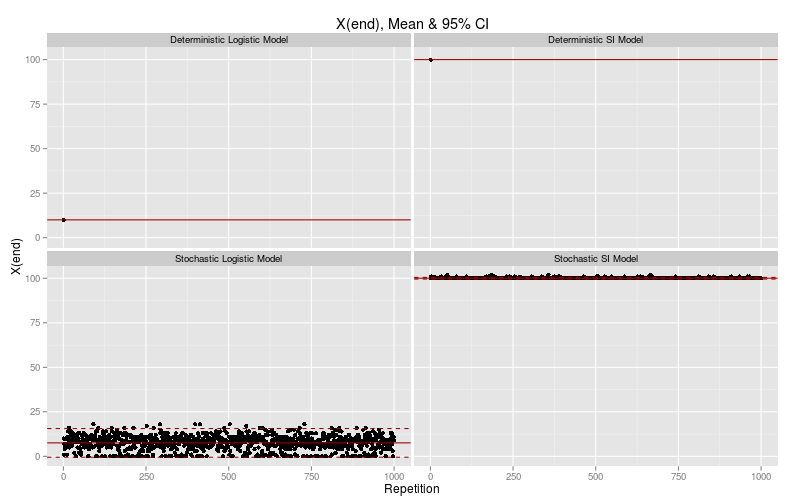 

#### End sample summary:

```r
End_summary <- ddply(within_summary, .(Model), summarise, Av_end_X = mean(X_end), 
    CI_low = mean(X_end) - 1.9604 * sd(X_end), CI_high = mean(X_end) + 1.9604 * 
        sd(X_end))
print(End_summary)
```

```
##                          Model Av_end_X  CI_low CI_high
## 1 Deterministic Logistic Model   10.000      NA      NA
## 2       Deterministic SI Model  100.000      NA      NA
## 3    Stochastic Logistic Model    7.565 -0.4876   15.62
## 4          Stochastic SI Model  100.052 99.5825  100.52
```

#### Percent Extinction summary:

```r
PercentExtinct <- ddply(within_summary, .(Model), summarise, PercentExtinct = length(X_end[X_end < 
    0.5])/length(X_end) * 100)
print(PercentExtinct)
```

```
##                          Model PercentExtinct
## 1 Deterministic Logistic Model            0.0
## 2       Deterministic SI Model            0.0
## 3    Stochastic Logistic Model           10.9
## 4          Stochastic SI Model            0.0
```

#### End sample summary (discriminating extinct):

```r
No_ext_End_summary <- ddply(within_summary[within_summary$X_end > 0.5, ], .(Model), 
    summarise, Av_end_X = mean(X_end), CI_low = mean(X_end) - 1.9604 * sd(X_end), 
    CI_high = mean(X_end) + 1.9604 * sd(X_end))
print(No_ext_End_summary)
```

```
##                          Model Av_end_X CI_low CI_high
## 1 Deterministic Logistic Model    10.00     NA      NA
## 2       Deterministic SI Model   100.00     NA      NA
## 3    Stochastic Logistic Model     8.49  1.967   15.01
## 4          Stochastic SI Model   100.05 99.583  100.52
```

